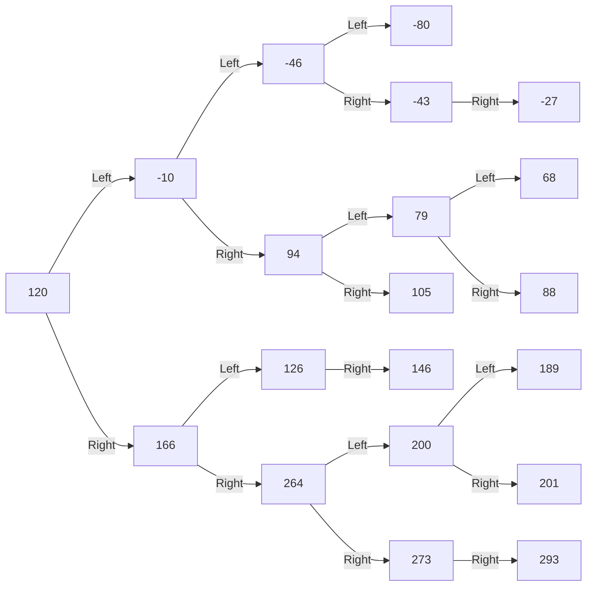

---

title: AVL树 - 算法 - dianhsu.top
---
@import "/mystyle.less"

## AVL 树

> 返回:house:[首页](../../index.html)，:rocket:[算法](../index.html)

---





```cpp
/**
 * @brief AVL 树
 * @author dianhsu
 * @date 2021/05/25
 * @ref https://zh.wikipedia.org/wiki/AVL树
 * */
#include <bits/stdc++.h>

template<class T>
struct AVLNode {
    T data;
    AVLNode<T> *leftChild;
    AVLNode<T> *rightChild;
    int height;

    AVLNode(T data) {
        this->data = data;
        this->height = 1;
        this->leftChild = nullptr;
        this->rightChild = nullptr;
    }

    ~AVLNode() {
        if (leftChild != nullptr) {
            delete this->leftChild;
            this->leftChild = nullptr;
        }
        if (rightChild != nullptr) {
            delete this->rightChild;
            this->rightChild = nullptr;
        }
    }

};

template<class T>
class AVL {
public:
    AVL() {
        root = nullptr;
    }

    ~AVL() {
        delete root;
    }

    /**
     * @brief 将结点插入到AVL树中
     * @param val 需要插入的值
     * @note 如果发现这个树中已经有这个值存在了，就不会进行任何操作
     * */
    void insert(T val) {
        this->_insert(&root, val);
    }

    /**
     * @brief 检查结点是否在AVL树中
     * @param val 需要检查的值
     * */
    bool exist(T val) {
        auto ptr = &root;
        while (*ptr != nullptr) {
            if (val == (*ptr)->data) {
                return true;
            } else if (val < (*ptr)->data) {
                *ptr = (*ptr)->leftChild;
            } else {
                *ptr = (*ptr)->rightChild;
            }
        }
        return false;
    }

    /**
     * @brief 找到值为val的结点
     * @param val 目标值
     * @return 返回值为指向该结点的指针的地址
     */
    AVLNode<T> **find(T val) {
        auto ptr = &root;
        while ((*ptr) != nullptr) {
            if (val == (*ptr)->data) {
                break;
            } else if (val < (*ptr)->data) {
                *ptr = (*ptr)->leftChild;
            } else {
                *ptr = (*ptr)->rightChild;
            }
        }
        return ptr;
    }

    /**
     * @brief 删除结点
     * @note 首先找到结点，然后将结点旋转到叶子结点，然后回溯检查树的平衡性
     * @param val 需要删除的结点的值
     * @note 这个地方需要递归寻找该值的结点，因为需要回溯更新平衡树
     * */
    void remove(T val) {
        _remove(&root, val);
    }

    /**
     * @brief 生成Mermaid图形
     * @note 只是为了debug用的，可以将图形放到Mermaid中，方便观察二叉树的形状
     * @ref https://mermaid-js.github.io/mermaid-live-editor
     * */
    friend std::ostream &operator<<(std::ostream &os, AVL &avl) {
        os << "graph LR" << std::endl;
        std::string name = "Node1";
        if (avl.root != nullptr) {
            avl._generate(os, avl.root, name);
        } else {
            os << "  " << name << "[ nullptr ]" << std::endl;
        }
        return os;
    }

private:
    void _remove(AVLNode<T> **ptr, T val) {
        if (*ptr == nullptr) {
            return;
        }
        if ((*ptr)->data == val) {
            _rotateNodeToLeaf(ptr);
        } else if ((*ptr)->data < val) {
            _remove(&((*ptr)->rightChild), val);
        } else {
            _remove(&((*ptr)->leftChild), val);
        }
        // 完了之后回溯，重新平衡二叉树
        _balance(ptr);
        _updateHeight(*ptr);
    }

    /**
     * @brief 将一个结点旋转到叶子结点
     * @param ptr 将要被旋转至叶子的结点的指针的地址
     * @note 旋转的时候，将当前结点旋转到高度比较小的一边。
     */
    void _rotateNodeToLeaf(AVLNode<T> **ptr) {
        // 当前结点已经是叶子结点了
        if ((*ptr)->leftChild == nullptr and (*ptr)->rightChild == nullptr) {
            *ptr = nullptr;
            return;
        }
        int leftHeight = (*ptr)->leftChild != nullptr ? (*ptr)->leftChild->height : 0;
        int rightHeight = (*ptr)->rightChild != nullptr ? (*ptr)->rightChild->height : 0;
        // 左边高度比较小，左旋
        if (leftHeight <= rightHeight) {
            _leftRotate(ptr);
            _rotateNodeToLeaf(&((*ptr)->leftChild));
        } else {
            // 右旋
            _rightRotate(ptr);
            _rotateNodeToLeaf(&((*ptr)->rightChild));
        }
        _balance(ptr);
        _updateHeight(*ptr);
    }

    /**
     * @brief 生成Mermaid图形的步骤
     *
     * */
    void _generate(std::ostream &os, AVLNode<T> *ptr, std::string &name) {
        if (ptr->leftChild != nullptr) {
            os << "  " << name << "[ " << ptr->data << " ] -- Left --> ";
            name += '0';
            os << name << "[ " << ptr->leftChild->data << " ]" << std::endl;
            _generate(os, ptr->leftChild, name);
            name.pop_back();
        }
        if (ptr->rightChild != nullptr) {
            os << "  " << name << "[ " << ptr->data << " ] -- Right --> ";
            name += '1';
            os << name << "[ " << ptr->rightChild->data << " ]" << std::endl;
            _generate(os, ptr->rightChild, name);
            name.pop_back();
        }
    }

    /**
     * @brief 插入结点
     *
     * */
    void _insert(AVLNode<T> **ptr, T val) {
        if (*ptr == nullptr) {
            *ptr = new AVLNode<T>(val);
            return;
        }
        if (val < (*ptr)->data) {
            _insert(&((*ptr)->leftChild), val);
        } else if (val > (*ptr)->data) {
            _insert(&((*ptr)->rightChild), val);
        } else {
            // 如果当前平衡二叉树中已经存在这个结点了，不做任何处理
            return;
        }
        _balance(ptr);
        _updateHeight(*ptr);
    }

    /**
     * @brief 平衡结点
     *
     * */
    void _balance(AVLNode<T> **ptr) {
        if (*ptr == nullptr) return;
        int leftHeight = (*ptr)->leftChild != nullptr ? (*ptr)->leftChild->height : 0;
        int rightHeight = (*ptr)->rightChild != nullptr ? (*ptr)->rightChild->height : 0;
        if (abs(leftHeight - rightHeight) <= 1) return;

        if (leftHeight < rightHeight) {
            auto rightElement = (*ptr)->rightChild;
            int rightElementLeftHeight = rightElement->leftChild != nullptr ? rightElement->leftChild->height : 0;
            int rightElementRightHeight = rightElement->rightChild != nullptr ? rightElement->rightChild->height : 0;
            if (rightElementLeftHeight < rightElementRightHeight) {
                // RR
                _leftRotate(ptr);
            } else {
                // RL
                _rightRotate(&((*ptr)->rightChild));
                _leftRotate(ptr);
            }
        } else {
            auto leftElement = (*ptr)->leftChild;
            int leftElementLeftHeight = leftElement->leftChild != nullptr ? leftElement->leftChild->height : 0;
            int leftElementRightHeight = leftElement->rightChild != nullptr ? leftElement->rightChild->height : 0;
            if (leftElementLeftHeight > leftElementRightHeight) {
                // LL
                _rightRotate(ptr);
            } else {
                // LR
                _leftRotate(&((*ptr)->leftChild));
                _rightRotate(ptr);
            }
        }
    }

    /**
     * @brief 右旋
     *
     * */
    void _rightRotate(AVLNode<T> **ptr) {
        auto tmp = (*ptr)->leftChild;
        (*ptr)->leftChild = tmp->rightChild;
        tmp->rightChild = *ptr;
        _updateHeight(tmp);
        _updateHeight(*ptr);
        *ptr = tmp;
    }

    /**
     * @brief 左旋
     * */
    void _leftRotate(AVLNode<T> **ptr) {
        auto tmp = (*ptr)->rightChild;
        (*ptr)->rightChild = tmp->leftChild;
        tmp->leftChild = *ptr;
        _updateHeight(tmp);
        _updateHeight(*ptr);
        *ptr = tmp;
    }

    void _updateHeight(AVLNode<T> *ptr) {
        if (ptr == nullptr) return;
        int leftHeight = ptr->leftChild != nullptr ? ptr->leftChild->height : 0;
        int rightHeight = ptr->rightChild != nullptr ? ptr->rightChild->height : 0;
        ptr->height = std::max(leftHeight, rightHeight) + 1;
    }

    AVLNode<T> *root;
};

int main() {
    auto avl = new AVL<int>();
    int n = 20;
    std::random_device rd{};
    std::mt19937 gen{rd()};
    std::normal_distribution<> d{100, 100};
    std::uniform_int_distribution<int> u(0, INT_MAX >> 1);
    std::vector<int> vec;
    for (int i = 0; i < n; ++i) {
        vec.push_back((int) std::round(d(gen)));
        //vec.push_back(i);
    }
    for (auto it : vec) {
        avl->insert(it);
    }
    avl->remove(15);
    avl->remove(32);
    avl->remove(31);
    std::cout << *avl << std::endl;
    delete avl;
    return 0;
}
```