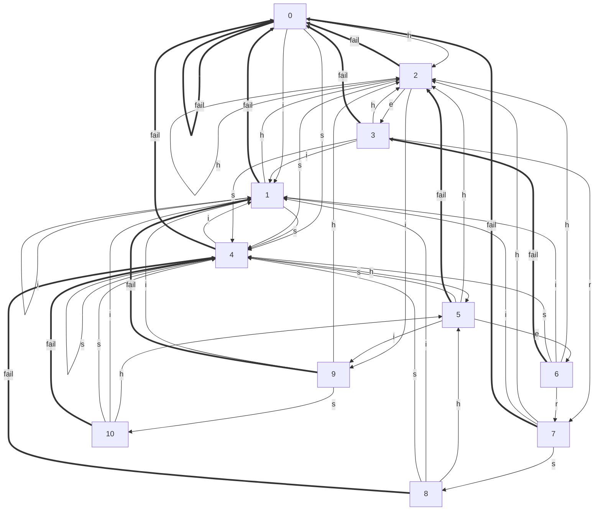

---

title: AC自动机 - 算法 - dianhsu.top
---
@import "/mystyle.less"

## AC 自动机
> 返回:house:[首页](../../index.html)，:rocket:[算法](../index.html)

---

### 示意图


### 参考模板
```cpp
/**
 * @brief AC自动机
 * @author dianhsu
 * @date 2021/05/26
 * @ref http://oi-wiki.com/string/ac-automaton/
 * */

#include <bits/stdc++.h>

template<int N = 1000010>
class ACAutomaton {
public:
    ACAutomaton() : tot(0) {

    }

    void insert(const std::string &str) {
        int u = 0;
        for (auto it: str) {
            if (!nex[u][it - 'a']) {
                nex[u][it - 'a'] = ++tot;
            }
            u = nex[u][it - 'a'];
        }
        e[u]++;
    }

    void build() {
        std::queue<int> Q;
        for (int i = 0; i < 26; i++)
            if (nex[0][i]) Q.push(nex[0][i]);
        while (!Q.empty()) {
            int u = Q.front();
            Q.pop();
            for (int i = 0; i < 26; i++) {
                if (nex[u][i]) {
                    fail[nex[u][i]] = nex[fail[u]][i];
                    Q.push(nex[u][i]);
                } else {
                    nex[u][i] = nex[fail[u]][i];
                }
            }
        }
    }

    int query(const std::string &str) {
        int u = 0, res = 0;
        for (auto it: str) {
            u = nex[u][it - 'a'];
            for (int j = u; j and e[j] != -1; j = fail[j]) {
                res += e[j];
                e[j] = -1;
            }
        }
        return res;
    }

    friend std::ostream &operator<<(std::ostream &out, ACAutomaton<N>& ac) {
        out << "graph LR" << std::endl;
        for (int i = 0; i <= ac.tot; ++i) {
            for (int j = 0; j < 26; ++j) {
                if (ac.nex[i][j] != 0) {
                    out << "  " << i << " -- " << (char) (j + 'a') << " --> " << ac.nex[i][j] << std::endl;
                }
            }
        }
        for(int i = 0; i <= ac.tot; ++i){
            out << "  " << i << " == fail ==> " << ac.fail[i] << std::endl;
        }
        return out;
    }

private:


    int nex[N][26]{}, tot;
    int e[N]{}, fail[N]{};
};

int main() {
    auto ac = new ACAutomaton();
    ac->insert("i");
    ac->insert("he");
    ac->insert("she");
    ac->insert("hers");
    ac->insert("his");
    ac->build();
    std::cout << *ac << std::endl;
    //std::cout << ac->query("ushersheishis") << std::endl;
    return 0;
}
```