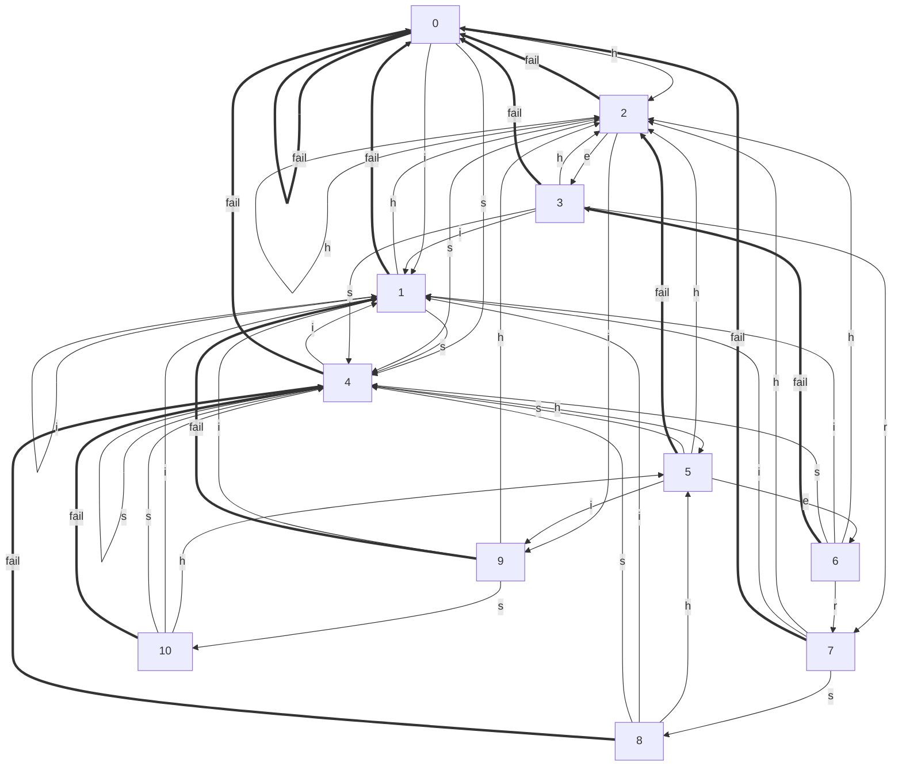

@import "/mystyle.less"
## 字符串 {ignore=True}
> 返回:house:[首页](../../index.html)
> 返回:rocket:[算法](../index.html)

-----------------------------------

[TOC]

### KMP字符串匹配

@import "./KMP.cpp" {code_block=true class="line-numbers"}

### Manacher

@import "./manacher.cpp" {code_block=true class="line-numbers"}

### AC自动机(AC Automaton)

@import "./ac_automaton.cpp" {code_block=true class="line-numbers"}
